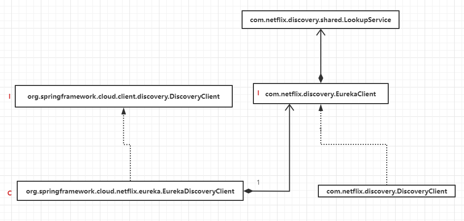

## eureka核心要素： 
1. 服务注册中心 :提供服务注册和服务发现的功能 [eureka-server]()
2. 服务提供者 : 作为客户端在注册中心进行注册，并向服务消费者提供服务 , [hello-world](../hello-world) 
3. 服务消费者 : 作为客户端在注册中心注册，可以发现在注册中心注册的其他客户端并进行消费（远程调用）[ribbon-consumer](../ribbon-consumer) 以及 **feign**

## 原理
将一个普通的 Spring Boot 应用注册到 Eureka Server 或是从 Eureka Server 中获 取服务列表时， 主要就做了两件事: 
- 在应用主类配置@EnableDiscoryClient注解. 
- 在application.properties中使用 eureka.client.serviceUrl.defaultZone 参数指定了服务注册中心的位置。

**com.netflix.discovery.DiscoveryClient**: 

- 向Eureka Server注册服务实例

- 向Eureka Server服务租约

- 当服务关闭期间， 向Eureka Server取消租约

- 查询Eureka Server中的服务实例列表

Eureka Client还需要配置一个Eureka Server的 URL列表。
