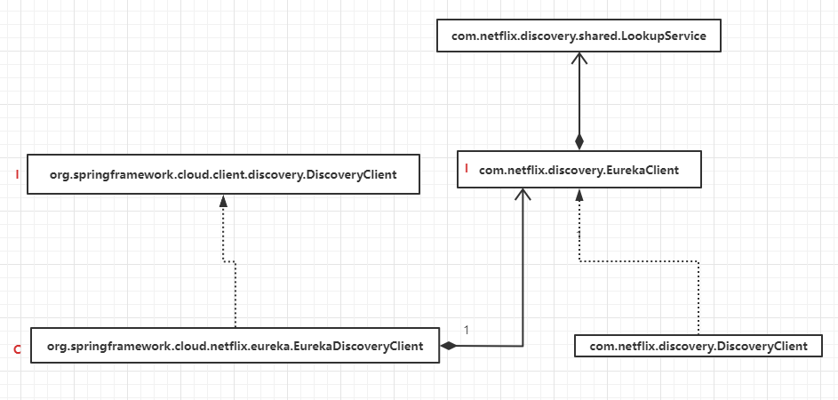
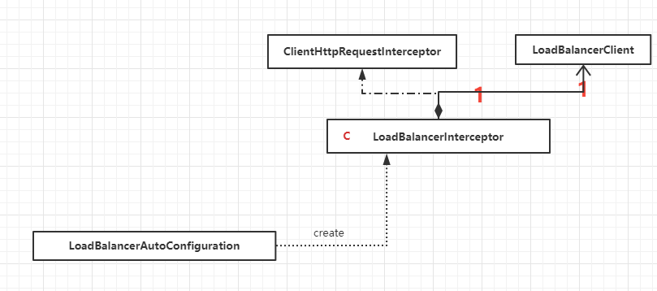

# 服务治理： Spring Cloud Eureka

## 服务治理机制： 

1. 服务注册中心 :提供服务注册和服务发现的功能 [eureka-server](eureka-server)
   - 失效剔除
   - 自我保护
2. 服务提供者 : 作为客户端在注册中心进行注册，并向服务消费者提供服务 , [hello-world](hello-world) 
   - 服务注册：
   - 服务同步：会同步到集群中的所有注册中心
   - 服务续约：Renew
3. 服务消费者 : 作为客户端在注册中心注册，可以发现在注册中心注册的其他客户端并进行消费（远程调用）[ribbon-consumer](ribbon-consumer) 以及 **feign**
   - 获取服务： 定时去server端获取服务列表
   - 服务调用 ： 重点关注`Region` 和`Zone`
   - 服务下线:satisfied: 客户端下线也会发rest请求到server端

## 使用

引入依赖：

```xml
 <dependency>
     <groupId>org.springframework.cloud</groupId>
     <artifactId>spring-cloud-starter-netflix-eureka-server</artifactId>
 </dependency>
```

启动类加上注解开启服务:

```java
@SpringBootApplication
@EnableEurekaServer
public class EurekaServerApplication {

    public static void main(String[] args) {
        SpringApplication.run(EurekaServerApplication.class, args);
    }

}
```

配置注册中心：

```
server.port=1111
eureka.instance.hostname=localhost
# 不会启动注册操作 自己不会注册自己
eureka.client.register-with-eureka=false  
eureka.client.fetch-registry=false
# 服务中心的地址 其他客户端需要填写这个地址才能进行注册
eureka.client.serviceUrl.defaultZone=http://${eureka.instance.hostname}:${server.port}/eureka/
# 续约任务间隔时间
eureka.instance.lease-renewal-interval-in-seconds=30
# 服务失效时间
eureka.instance.lease-expiration-duration-in-seconds=90
```

## 原理

将一个普通的 Spring Boot 应用注册到 Eureka Server 或是从 Eureka Server 中获 取服务列表时， 主要就做了两件事: 

- 在应用主类配置@EnableDiscoryClient注解. 
- 在application.properties中使用 eureka.client.serviceUrl.defaultZone 参数指定了服务注册中心的位置。



**com.netflix.discovery.DiscoveryClient**: 

- 向Eureka Server注册服务实例

- 向Eureka Server服务租约

- 当服务关闭期间， 向Eureka Server取消租约

- 查询Eureka Server中的服务实例列表

Eureka Client还需要配置一个Eureka Server的 URL列表。

在进行服务注册和获取服务之前，Eureka要加载两个重要的内容，第一个是**Region** 第二个是**Zone**

在获取了 Region 和 Zone 的信息之后， 才开始真正加载 Eureka Server 的具体地址。 它

根据传入的参数按一定算法确定加载位于哪一个 Zone 配置的 serviceUris。

`com.netflix.discovery.endpoint.EndpointUtils`

```java
public static Map<String, List<String>> getServiceUrlsMapFromConfig(EurekaClientConfig clientConfig, String instanceZone, boolean preferSameZone) {
        Map<String, List<String>> orderedUrls = new LinkedHashMap<>();
        String region = getRegion(clientConfig);
        String[] availZones = clientConfig.getAvailabilityZones(clientConfig.getRegion());
        if (availZones == null || availZones.length == 0) {
            availZones = new String[1];
            availZones[0] = DEFAULT_ZONE;
        }
        logger.debug("The availability zone for the given region {} are {}", region, availZones);
        int myZoneOffset = getZoneOffset(instanceZone, preferSameZone, availZones);

        String zone = availZones[myZoneOffset];
        List<String> serviceUrls = clientConfig.getEurekaServerServiceUrls(zone); // 重点
        if (serviceUrls != null) {
            orderedUrls.put(zone, serviceUrls);
        }
        int currentOffset = myZoneOffset == (availZones.length - 1) ? 0 : (myZoneOffset + 1);
        while (currentOffset != myZoneOffset) {
            zone = availZones[currentOffset];
            serviceUrls = clientConfig.getEurekaServerServiceUrls(zone);
            if (serviceUrls != null) {
                orderedUrls.put(zone, serviceUrls);
            }
            if (currentOffset == (availZones.length - 1)) {
                currentOffset = 0;
            } else {
                currentOffset++;
            }
        }

        if (orderedUrls.size() < 1) {
            throw new IllegalArgumentException("DiscoveryClient: invalid serviceUrl specified!");
        }
        return orderedUrls;
    }
```


`org.springframework.cloud.netflix.eureka.EurekaClientConfigBean`

```java
public List<String> getEurekaServerServiceUrls(String myZone) {
		String serviceUrls = this.serviceUrl.get(myZone);
		if (serviceUrls == null || serviceUrls.isEmpty()) {
			serviceUrls = this.serviceUrl.get(DEFAULT_ZONE);
		}
		if (!StringUtils.isEmpty(serviceUrls)) {
			final String[] serviceUrlsSplit = StringUtils
					.commaDelimitedListToStringArray(serviceUrls);
			List<String> eurekaServiceUrls = new ArrayList<>(serviceUrlsSplit.length);
			for (String eurekaServiceUrl : serviceUrlsSplit) {
				if (!endsWithSlash(eurekaServiceUrl)) {
					eurekaServiceUrl += "/";
				}
				eurekaServiceUrls.add(eurekaServiceUrl.trim());
			}
			return eurekaServiceUrls;
		}

		return new ArrayList<>();
	}
```

`this.serviceUrl` 是我们在配置文件中通过参数 

```
# 注册中心地址
eureka.client.service-url.defaultZone=http://localhost:1111/eureka/
```

来配置的

### 服务注册

```java
/**
 * Annotation to enable a DiscoveryClient implementation.
 * @author Spencer Gibb
 */
@Target(ElementType.TYPE)
@Retention(RetentionPolicy.RUNTIME)
@Documented
@Inherited
@Import(EnableDiscoveryClientImportSelector.class)
public @interface EnableDiscoveryClient {

	/**
	 * If true, the ServiceRegistry will automatically register the local server.
	 * @return - {@code true} if you want to automatically register.
	 */
	boolean autoRegister() default true;

}
```

通过这个注解，来注入`DiscoveryClient` 实例

Spring Cloud 官方提供的 DiscoveryClient 

```java
/**
 * Represents read operations commonly available to discovery services such as Netflix
 * Eureka or consul.io.
 *
 * @author Spencer Gibb
 * @author Olga Maciaszek-Sharma
 * @author Chris Bono
 */
public interface DiscoveryClient extends Ordered {

	/**
	 * Default order of the discovery client.
	 */
	int DEFAULT_ORDER = 0;

	/**
	 * A human-readable description of the implementation, used in HealthIndicator.
	 * @return The description.
	 */
	String description();

	/**
	 * Gets all ServiceInstances associated with a particular serviceId.
	 * @param serviceId The serviceId to query.
	 * @return A List of ServiceInstance.
	 */
	List<ServiceInstance> getInstances(String serviceId);

	/**
	 * @return All known service IDs.
	 */
	List<String> getServices();

	/**
	 * Can be used to verify the client is valid and able to make calls.
	 * <p>
	 * A successful invocation with no exception thrown implies the client is able to make
	 * calls.
	 * <p>
	 * The default implementation simply calls {@link #getServices()} - client
	 * implementations can override with a lighter weight operation if they choose to.
	 */
	default void probe() {
		getServices();
	}

	/**
	 * Default implementation for getting order of discovery clients.
	 * @return order
	 */
	@Override
	default int getOrder() {
		return DEFAULT_ORDER;
	}

}
```

eureka中提供了 `com.netflix.discovery.DiscoveryClient` 来实现向服务进行注册、续约、获取服务列表。

```java
private void initScheduledTasks() {
        ....
		
        if (clientConfig.shouldRegisterWithEureka()) {
            int renewalIntervalInSecs = instanceInfo.getLeaseInfo().getRenewalIntervalInSecs();
            int expBackOffBound = clientConfig.getHeartbeatExecutorExponentialBackOffBound();
            logger.info("Starting heartbeat executor: " + "renew interval is: {}", renewalIntervalInSecs);


            ....

            // InstanceInfo replicator
            instanceInfoReplicator = new InstanceInfoReplicator(
                    this,
                    instanceInfo,
                    clientConfig.getInstanceInfoReplicationIntervalSeconds(),
                    2); // burstSize

            statusChangeListener = new ApplicationInfoManager.StatusChangeListener() {
                @Override
                public String getId() {
                    return "statusChangeListener";
                }

                @Override
                public void notify(StatusChangeEvent statusChangeEvent) {
                    logger.info("Saw local status change event {}", statusChangeEvent);
                    instanceInfoReplicator.onDemandUpdate();
                }
            };

            if (clientConfig.shouldOnDemandUpdateStatusChange()) {
                applicationInfoManager.registerStatusChangeListener(statusChangeListener);
            }
			// 开启服务注册的定时任务
            instanceInfoReplicator.start(clientConfig.getInitialInstanceInfoReplicationIntervalSeconds());
        } else {
            logger.info("Not registering with Eureka server per configuration");
        }
    }
```


在if (clientConfig.shouldRegisterWithEureka())  分支里面创建了一个 InstanceInfoReplicator 对象，它会执行定时任务，重点关注该对象的run方法：

```java
 public void run() {
     try {
         discoveryClient.refreshInstanceInfo();

         Long dirtyTimestamp = instanceInfo.isDirtyWithTime();
         if (dirtyTimestamp != null) {
             discoveryClient.register();
             instanceInfo.unsetIsDirty(dirtyTimestamp);
         }
     } catch (Throwable t) {
         logger.warn("There was a problem with the instance info replicator", t);
     } finally {
         Future next = scheduler.schedule(this, replicationIntervalSeconds, TimeUnit.SECONDS);
         scheduledPeriodicRef.set(next);
     }
 }
```

通过 discoveryClient.register()进行服务的注册

```java
boolean register() throws Throwable {
    logger.info(PREFIX + "{}: registering service...", appPathIdentifier);
    EurekaHttpResponse<Void> httpResponse;
    try {
        // 通过http方式进行注册
        httpResponse = eurekaTransport.registrationClient.register(instanceInfo);
    } catch (Exception e) {
        logger.warn(PREFIX + "{} - registration failed {}", appPathIdentifier, e.getMessage(), e);
        throw e;
    }
    if (logger.isInfoEnabled()) {
        logger.info(PREFIX + "{} - registration status: {}", appPathIdentifier, httpResponse.getStatusCode());
    }
    return httpResponse.getStatusCode() == Status.NO_CONTENT.getStatusCode();
}
```


### 服务获取和服务续约

- 服务获取

```java
private void initScheduledTasks() {
    if (clientConfig.shouldFetchRegistry()) {
                // registry cache refresh timer
                int registryFetchIntervalSeconds = clientConfig.getRegistryFetchIntervalSeconds();
                int expBackOffBound = clientConfig.getCacheRefreshExecutorExponentialBackOffBound();
                cacheRefreshTask = new TimedSupervisorTask(
                        "cacheRefresh",
                        scheduler,
                        cacheRefreshExecutor,
                        registryFetchIntervalSeconds,
                        TimeUnit.SECONDS,
                        expBackOffBound,
                    //  定时去获取服务列表
                        new CacheRefreshThread()
                );
                scheduler.schedule(
                        cacheRefreshTask,
                        registryFetchIntervalSeconds, TimeUnit.SECONDS);
            }
     ....	
 }
```

- 服务续约

  ```java
  // 服务续约定时任务
  boolean renew() {
          EurekaHttpResponse<InstanceInfo> httpResponse;
          try {
              httpResponse = eurekaTransport.registrationClient.sendHeartBeat(instanceInfo.getAppName(), instanceInfo.getId(), instanceInfo, null);
              logger.debug(PREFIX + "{} - Heartbeat status: {}", appPathIdentifier, httpResponse.getStatusCode());
              if (httpResponse.getStatusCode() == Status.NOT_FOUND.getStatusCode()) {
                  REREGISTER_COUNTER.increment();
                  logger.info(PREFIX + "{} - Re-registering apps/{}", appPathIdentifier, instanceInfo.getAppName());
                  long timestamp = instanceInfo.setIsDirtyWithTime();
                  boolean success = register();
                  if (success) {
                      instanceInfo.unsetIsDirty(timestamp);
                  }
                  return success;
              }
              return httpResponse.getStatusCode() == Status.OK.getStatusCode();
          } catch (Throwable e) {
              logger.error(PREFIX + "{} - was unable to send heartbeat!", appPathIdentifier, e);
              return false;
          }
      }
  ```

  

### 服务注册中心处理

客户端和服务端所有交互都是以REST请求来进行。请求处理都在 `com.netflix.eureka.resources` 包下，比如服务注册：

`com.netflix.eureka.resources.ApplicationResource` 这个类进行处理

```java
  /**
     * Registers information about a particular instance for an
     * {@link com.netflix.discovery.shared.Application}.
     *
     * @param info
     *            {@link InstanceInfo} information of the instance.
     * @param isReplication
     *            a header parameter containing information whether this is
     *            replicated from other nodes.
     */
    @POST
    @Consumes({"application/json", "application/xml"})
    public Response addInstance(InstanceInfo info,
                                @HeaderParam(PeerEurekaNode.HEADER_REPLICATION) String isReplication) {
        logger.debug("Registering instance {} (replication={})", info.getId(), isReplication);
        // validate that the instanceinfo contains all the necessary required fields
        if (isBlank(info.getId())) {
            return Response.status(400).entity("Missing instanceId").build();
        } else if (isBlank(info.getHostName())) {
            return Response.status(400).entity("Missing hostname").build();
        } else if (isBlank(info.getIPAddr())) {
            return Response.status(400).entity("Missing ip address").build();
        } else if (isBlank(info.getAppName())) {
            return Response.status(400).entity("Missing appName").build();
        } else if (!appName.equals(info.getAppName())) {
            return Response.status(400).entity("Mismatched appName, expecting " + appName + " but was " + info.getAppName()).build();
        } else if (info.getDataCenterInfo() == null) {
            return Response.status(400).entity("Missing dataCenterInfo").build();
        } else if (info.getDataCenterInfo().getName() == null) {
            return Response.status(400).entity("Missing dataCenterInfo Name").build();
        }

        // handle cases where clients may be registering with bad DataCenterInfo with missing data
        DataCenterInfo dataCenterInfo = info.getDataCenterInfo();
        if (dataCenterInfo instanceof UniqueIdentifier) {
            String dataCenterInfoId = ((UniqueIdentifier) dataCenterInfo).getId();
            if (isBlank(dataCenterInfoId)) {
                boolean experimental = "true".equalsIgnoreCase(serverConfig.getExperimental("registration.validation.dataCenterInfoId"));
                if (experimental) {
                    String entity = "DataCenterInfo of type " + dataCenterInfo.getClass() + " must contain a valid id";
                    return Response.status(400).entity(entity).build();
                } else if (dataCenterInfo instanceof AmazonInfo) {
                    AmazonInfo amazonInfo = (AmazonInfo) dataCenterInfo;
                    String effectiveId = amazonInfo.get(AmazonInfo.MetaDataKey.instanceId);
                    if (effectiveId == null) {
                        amazonInfo.getMetadata().put(AmazonInfo.MetaDataKey.instanceId.getName(), info.getId());
                    }
                } else {
                    logger.warn("Registering DataCenterInfo of type {} without an appropriate id", dataCenterInfo.getClass());
                }
            }
        }

        registry.register(info, "true".equals(isReplication));
        return Response.status(204).build();  // 204 to be backwards compatible
    }
```


# 客户端负载均衡:Spring Cloud Ribbon

> Spring Cloud Ribbon 是一个基于HTTP 和TCP的客户端负载均衡工具。

- **负载均衡**: 简单来说就是将所有的请求先汇聚在一起，然后通过一系列的算法对请求进行分发，让服务器达到最高的处理效率，降低系统的压力。<br>
- **服务端负载均衡**:  需要通过专门的一台提供负载均衡的服务器来实现。负载均衡服务器通过均衡算法将所有请求服务器的请求分发到不同的服务器上。<br>
- **客户端负载均衡** : 客户端本身就能够实现。客户端本身从注册中心获取所有的服务，然后通过均衡算法将请求的分发到对应的服务上<br>


## 使用

引入依赖：

```xml
<dependencies>
    <dependency>
        <groupId>org.springframework.cloud</groupId>
        <artifactId>spring-cloud-starter-netflix-eureka-client</artifactId>
    </dependency>
    <dependency>
        <groupId>org.springframework.boot</groupId>
        <artifactId>spring-boot-starter-web</artifactId>
    </dependency>
</dependencies>
```

加上注解：

```java
@SpringBootApplication
@EnableEurekaClient
public class HelloWorldApplication {

    public static void main(String[] args) {
        SpringApplication.run(HelloWorldApplication.class, args);
    }

}
```

配置注册中心：

```properties
# 实例名称（注册到注册中心的名称)
spring.application.name=hello-service
# 注册中心地址
eureka.client.service-url.defaultZone=http://localhost:1111/eureka/
```

## 原理

核心类


## 负载均衡策略、算法


- RandomRule: 从服务列表中随机选择服务

- RoundRobinRule: 以轮询的方式选择服务

- RetryRule: 以轮询的方式选择服务，会在约定时间内重试直到选择到该服务（内部用RoundRobinRule实现）

- **WeightedResponseTimeRule**: 对RoundRobinRule的扩展，增加了根据实例的运行情况来计算权重， 并

  根据权重来挑选实例， 以达到更优的分配效果。核心组件：

    - 定时任务：启动一个定时任务，用来为每一个服务实例计算权重，每30s执行一次。
    - 权重计算：计算的是每个实例的权重区间，并非实例的优先级。每个实例的区间下限是上一个实例的区间上限 ， 而每个实例的区间上限则是 我们上面计算并存储于`ListaccumulatedWeights`中的权重值， 其中第一个实例的下限默认为零。
      - 根据`LoadBalancerStats`中记录的每个实例的统计信息， 累加所有 实例的平均响应时间， 得到总平均响应时间`totalResponseTime`, 该值会用于后续的计算。
      - 为负载均衡器中维护的实例清单逐个计算权重（从第 一个开始）， 计算规则为(`weightSoFar`+`totalResponseTime` - `实例的平均响应时间`)，其中`weightSoFar`初始化为零， 并且每 计算好一个权重需要累加到 `weightSoFar`上供下一次计算使用。
    - 实例选择：
      - 生成一个[0,最大权重值)的随机数  `Random.nextDouble`
      - 遍历通过`权重计算` 计算出来的权重列表,比较权重的大小，如果权重值大于等千随机数， 就拿当前权重列表的索引值去服务实例列表中获取具体的实例

**示例**：[ribbon-consumer](/ribbon-consumer)


由以上可知 负载均衡是由 `@LoadBalanced` 注解来开启 ，标记RestTemplate，以使用LoadBalancerClient 来配置它

```java
/**
 * Annotation to mark a RestTemplate or WebClient bean to be configured to use a
 * LoadBalancerClient.
 * @author Spencer Gibb
 */
@Target({ ElementType.FIELD, ElementType.PARAMETER, ElementType.METHOD })
@Retention(RetentionPolicy.RUNTIME)
@Documented
@Inherited
@Qualifier
public @interface LoadBalanced {

}
	
```

`LoadBalancerClient `

```java
public interface LoadBalancerClient extends ServiceInstanceChooser {
    // 根据传入的 服 务名serviceld, 从负载均衡器中挑选一个对应服务的实例 。
    ServiceInstance choose(String serviceId); 
	// 使用从负载均衡器中挑选出来的服务实例来发起请求
	<T> T execute(String serviceId, LoadBalancerRequest<T> request) throws IOException;
	<T> T execute(String serviceId, ServiceInstance serviceInstance,
			LoadBalancerRequest<T> request) throws IOException;
    // 将服务名 替换成对应的ip:port方式
	URI reconstructURI(ServiceInstance instance, URI original);
}
```


重要的自动配置类 加载 LoadBalancerClient 和 LoadBalancerInterceptor对象,

```java
@Configuration(proxyBeanMethods = false)
@ConditionalOnClass(RestTemplate.class)
@ConditionalOnBean(LoadBalancerClient.class)
@EnableConfigurationProperties(LoadBalancerRetryProperties.class)
public class LoadBalancerAutoConfiguration {

	@LoadBalanced
	@Autowired(required = false)
	private List<RestTemplate> restTemplates = Collections.emptyList();

	@Autowired(required = false)
	private List<LoadBalancerRequestTransformer> transformers = Collections.emptyList();

	@Bean
	public SmartInitializingSingleton loadBalancedRestTemplateInitializerDeprecated(
			final ObjectProvider<List<RestTemplateCustomizer>> restTemplateCustomizers) {
		return () -> restTemplateCustomizers.ifAvailable(customizers -> {
			for (RestTemplate restTemplate : LoadBalancerAutoConfiguration.this.restTemplates) {
				for (RestTemplateCustomizer customizer : customizers) {
					customizer.customize(restTemplate);
				}
			}
		});
	}

	@Bean
	@ConditionalOnMissingBean
	public LoadBalancerRequestFactory loadBalancerRequestFactory(
			LoadBalancerClient loadBalancerClient) {
		return new LoadBalancerRequestFactory(loadBalancerClient, this.transformers);
	}

	@Configuration(proxyBeanMethods = false)
	@ConditionalOnMissingClass("org.springframework.retry.support.RetryTemplate")
	static class LoadBalancerInterceptorConfig {
		
        // 进行请求的拦截，实现客户端负载均衡
		@Bean
		public LoadBalancerInterceptor loadBalancerInterceptor(
				LoadBalancerClient loadBalancerClient,
				LoadBalancerRequestFactory requestFactory) {
			return new LoadBalancerInterceptor(loadBalancerClient, requestFactory);
		}
		// 给RestTemplate增加一个LoadBalancerInterceptor拦截器
		@Bean
		@ConditionalOnMissingBean
		public RestTemplateCustomizer restTemplateCustomizer(
				final LoadBalancerInterceptor loadBalancerInterceptor) {
			return restTemplate -> {
				List<ClientHttpRequestInterceptor> list = new ArrayList<>(
						restTemplate.getInterceptors());
				list.add(loadBalancerInterceptor);
				restTemplate.setInterceptors(list);
			};
		}

	}

	/**
	 * Auto configuration for retry mechanism.
	 */
	@Configuration(proxyBeanMethods = false)
	@ConditionalOnClass(RetryTemplate.class)
	public static class RetryAutoConfiguration {

		@Bean
		@ConditionalOnMissingBean
		public LoadBalancedRetryFactory loadBalancedRetryFactory() {
			return new LoadBalancedRetryFactory() {
			};
		}

	}

	/**
	 * Auto configuration for retry intercepting mechanism.
	 */
	@Configuration(proxyBeanMethods = false)
	@ConditionalOnClass(RetryTemplate.class)
	public static class RetryInterceptorAutoConfiguration {

		@Bean
		@ConditionalOnMissingBean
		public RetryLoadBalancerInterceptor loadBalancerRetryInterceptor(
				LoadBalancerClient loadBalancerClient,
				LoadBalancerRetryProperties properties,
				LoadBalancerRequestFactory requestFactory,
				LoadBalancedRetryFactory loadBalancedRetryFactory) {
			return new RetryLoadBalancerInterceptor(loadBalancerClient, properties,
					requestFactory, loadBalancedRetryFactory);
		}

		@Bean
		@ConditionalOnMissingBean
		public RestTemplateCustomizer restTemplateCustomizer(
				final RetryLoadBalancerInterceptor loadBalancerInterceptor) {
			return restTemplate -> {
				List<ClientHttpRequestInterceptor> list = new ArrayList<>(
						restTemplate.getInterceptors());
				list.add(loadBalancerInterceptor);
				restTemplate.setInterceptors(list);
			};
		}

	}

}
```

@ConditionalOnClass(RestTemplate.class)
@ConditionalOnBean(LoadBalancerClient.class)

所以加载自动配置对象需要RestTemplate LoadBalancerClient对象

分析loadBalancerRetryInterceptor如何处理RestTemplate为客户端负载均衡,

```java
public class LoadBalancerInterceptor implements ClientHttpRequestInterceptor {

	private LoadBalancerClient loadBalancer;

	private LoadBalancerRequestFactory requestFactory;

	public LoadBalancerInterceptor(LoadBalancerClient loadBalancer,
			LoadBalancerRequestFactory requestFactory) {
		this.loadBalancer = loadBalancer;
		this.requestFactory = requestFactory;
	}

	public LoadBalancerInterceptor(LoadBalancerClient loadBalancer) {
		// for backwards compatibility
		this(loadBalancer, new LoadBalancerRequestFactory(loadBalancer));
	}

	@Override
	public ClientHttpResponse intercept(final HttpRequest request, final byte[] body,
			final ClientHttpRequestExecution execution) throws IOException {
		final URI originalUri = request.getURI();
		String serviceName = originalUri.getHost();
		Assert.state(serviceName != null,
				"Request URI does not contain a valid hostname: " + originalUri);
		return this.loadBalancer.execute(serviceName,
				this.requestFactory.createRequest(request, body, execution));
	}

}
```

当一个被@LoadBalanced 注解修饰的 RestTemplate 对象向外发起 HTTP 请求时， 会被 LoadBalancerintercep七or 类的 intercept 函数所拦截。

## 重试机制

hello-service:为注册的服务名称，以下配置通过服务名称来单独给此服务进行配置

-  spring.cloud.loadbalancer.retry.enabled: 该参数用来开启重试机制，它默认是关闭的。
- hystrix.command.default.execution.isolation.thread.timeoutInMilliseconds:断路器的超时时间需要大于Ribbon的超时时间， 不然不会触发重试.
- hello-service.ribbon.ConnectTimeout： 请求连接的超时时间
- hello-service.ribbon.ReadTimeout： 请求处理的超时时间。
- hello-service.ribbon.OkToRetryOnAllOperations:对所有操作请求都进行重试
- hello-service.ribbon.MaxAutoRetriesNextServer: 切换实例的重试次数。
- hello-service.ribbon.MaxAutoRetries:对当前实例的重试次数

> 根据如上配置， 当访问到故障请求的时候， 它会再尝试访问 一次当前实例（次数由MaxAutoRetries配置）， 如果不行， 就换 一个实例进行访问， 如果还是不行， 再换 一次实例访问（更换次数由MaxAutoRe红iesNextServer配置）， 如果依然不行， 返回失败信息。


# 服务容错保护：Spring Cloud Hystrix

> Hystrix具备 服务降级、服务熔断、线程和信号隔离、请求缓存、请求合并已经服务监控功能。

## 使用

- 引入依赖

引入了`spring-cloud-starter-netflix-eureka-client` ,就不用单独引入hystrix

要使用**@HystrixCommand注解**，需要引入

```xml-dtd
<dependency>
    <groupId>com.netflix.hystrix</groupId>
    <artifactId>hystrix-javanica</artifactId>
</dependency>
```


- 添加注解，启用熔断功能

```java
@SpringBootApplication
@EnableDiscoveryClient
@EnableCircuitBreaker
// 上面三个注解可以用 @SpringCloudApplication替换
public class RibbonConsumerApplication {

    @Bean
    @LoadBalanced
    RestTemplate restTemplate() {
        return new RestTemplate();
    }

    public static void main(String[] args) {
        SpringApplication.run(RibbonConsumerApplication.class, args);
    }

}
```


## 执行流程

1. 创建HystrixCommand或HystrixObservableCommand对象

2. 命令执行——同步、异步返回结果

3. 结果是否被缓存

   若当前命令的请求缓存功能是被启用的， 并且该命令缓存命中， 那么缓存的结果会立

   即以Observable 对象的形式 返回。

4. 断路器是否打开

   在命令结果没有缓存命中的时候， Hystrix在执行命令前需要检查断路器是否为打开状态：

   - 如果断路器是打开的，那么Hystrix不会执行命令，而是转接到fallback处理逻辑（对应下面第8步）。

   - 如果断路器是关闭的， 那么Hystrix跳到第5步，检查是否有可用资源来 执行命令。


5. 线程池/请求队列/信号量是否占满

   如果已经占满 则跳转到第八步，fallBack执行

6. HystrixObservableCommand.construct()或HystrixCommand.run()Hystrix会根据我们编写的方法来决定采取什么样的方式去请求依赖服务。

   - HystrixCommand.run(): 返回一个单一 的结果，或者抛出异常。
   - HystrixObservableCommand.construct() :返回一个Observable对象来发射多个结果，或通过onError发送错误通知。

   如果方法执行时间超过了阈值，那么直接会到第八步 fallback来进行处理

7. 计算断路器的健康度

8. fallback处理——降级处理

   - 第4步， 当前命令处于 “熔断I短路 ” 状态， 断路器是打开的时候。

   - 第5步， 当前命令的线程池、 请求队列或 者信号量被占满的时候。
   - 第6步，Hys红ixObservableCommand.cons七ruct()或HystrixCommand.run()抛出异常的时候。

9. 返回成功的响应

## 功能

- 依赖隔离——为每个依赖服务创建一个线程池来请求
- 服务降级
- 异常处理
- 请求缓存
- 请求合并


# 声明式服务调用： Spring Cloud Feign

## 使用

引入依赖:

```xml
<!-- springboot 父依赖 --> 
 <parent>
     <groupId>org.springframework.boot</groupId>
     <artifactId>spring-boot-starter-parent</artifactId>
     <version>2.3.12.RELEASE</version>
     <relativePath/> <!-- lookup parent from repository -->
</parent>
<!-- eureka、feign -->
<dependencies>
     <dependency>
         <groupId>org.springframework.boot</groupId>
         <artifactId>spring-boot-starter-web</artifactId>
     </dependency>
     <dependency>
         <groupId>org.springframework.cloud</groupId>
         <artifactId>spring-cloud-starter-netflix-eureka-server</artifactId>
     </dependency>
     <dependency>
         <groupId>org.springframework.cloud</groupId>
         <artifactId>spring-cloud-starter-openfeign</artifactId>
     </dependency>
</dependencies>

<!-- springcloud 依赖 -->
<dependencyManagement>
    <dependencies>
        <dependency>
            <groupId>org.springframework.cloud</groupId>
            <artifactId>spring-cloud-dependencies</artifactId>
            <version>${spring.cloud-version}</version>
            <type>pom</type>
            <scope>import</scope>
        </dependency>
    </dependencies>
</dependencyManagement>
```

开启feign客户端：

```java
@SpringBootApplication
@EnableFeignClients
@EnableDiscoveryClient
public class FeignConsumerApplication { 
    public static void main(String[] args) {
        SpringApplication.run(FeignConsumerApplication.class,args);
    }
}
```

绑定服务提供的REST接口:

```java
@FeignClient(value = "hello-service")
public interface HelloService {
    @RequestMapping("/hello")
    String hello();
}
```

调用服务：

```java
@RestController
public class HelloController {
    @Autowired
    private HelloService helloService;

    @GetMapping("/feign-consumer")
    public String helloConsumer() {
        return helloService.hello();
    }
}
```


## 功能

### 日志记录

调整feignclient日志级别：

1. 全局

```java
@SpringBootApplication
@EnableFeignClients
@EnableDiscoveryClient
public class FeignConsumerApplication {
    /**
     * 全局配置
     * @return
     */
    @Bean
    Logger.Level feignLoggerLevel(){
        return Logger.Level.FULL;
    }

    public static void main(String[] args) {
        SpringApplication.run(FeignConsumerApplication.class,args);
    }
}

```

2. 针对客户端

```java
@Configuration 
public class FullLogConfiguration { 
    @Bean 
    Logger.Level feignLoggerLevel() { 
    	return Logger.Level.FULL;
    }
}
---------------------------
@FeignClient(name= "HELLO-SERVICE", configura七ion = FullLogConfiguration.class) 
public interface HelloService {
}	

    

```


日志级别：

- NONE: 不记录任何日志
- BASIC: 仅记录请求方法、URL以及响应码和执行时间
- HEADERS：除了记录BASIC级别的信息之外， 还会记录请求和响应的头信息。
- FULL：记录所有请求与响应的明细， 包括头信息、 请求体、 元数据等。

# API 网关服务：Spring Cloud Zuul

